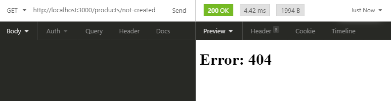
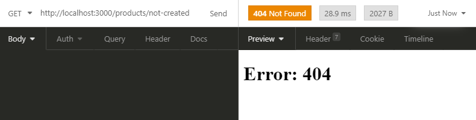

<h1 align="center">
    How to Return 404 while using  Fallback Blocking in Next.js
</h1>

<h3>This tiny example is part of the Medium article I created demonstrating how to properly return the status codes of pages generated with fallback blocking. </h3>

<br>

[Here is the Link for the article](https://medium.com)

<br>
<br>

<p>
  As default Next.js will handle errors originated from fallback blocking pages with the status code 200.
</p>

<p align="center">
  
</p>

<p>
  But with simple steps we can change that and display the status code we want.
</p>

<p align="center">
  
</p>

<br>
<br>

## How to run this code?

- First you need to clone this repository to your local machine.
- Now you need to installs all the dependencies:

```
yarn install
```

- After that you will need to build the Next app (The status code manipulation will not work in dev mode)

```
yarn build
```

- Before running the app we need to start our fake API with:

```
npx json-server server.json
```

- And finally we just need to run our application.

```
yarn start
```

## :memo: License

This project is under the MIT license. See the [LICENSE](LICENSE.md) for details.

---

Made with ♥ by Victor Alvarenga :wave: [Get in touch!](https://www.linkedin.com/in/victoralvarenga/)
